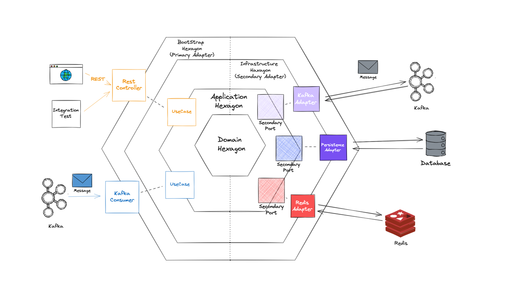
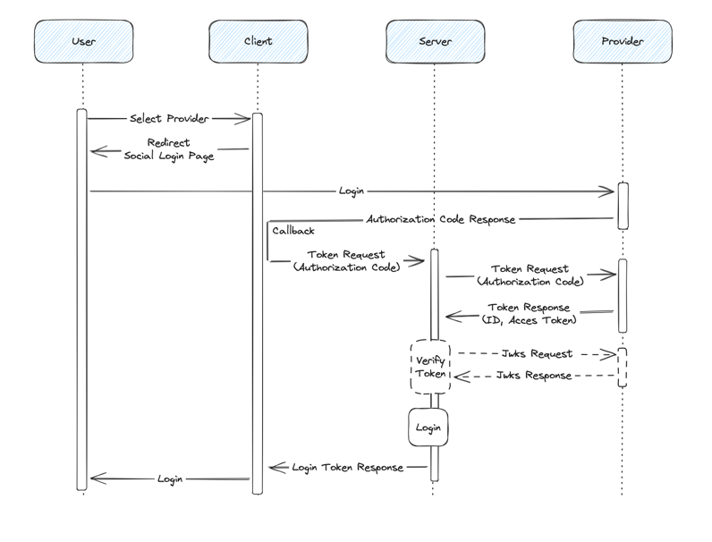

# 포도당

    

  

## 목차

- [📝 서비스 개요](#-서비스-개요)
- [🛰️ 주요 기능](#-핵심-기능-및-사용-흐름)
- [📚 용어 사전](#-용어-사전)
- [👨‍💻 유스케이스](#-유즈케이스)
- [🏗️ 아키텍처](#-아키텍처)
- [👷🏻 구현](#-구현)
- [📐 개발중 이슈](#-개발중-이슈)
- [📝 API 문서](#-api-문서)
- [🛢️ ERD](#-erd)
- [📚 참고 자료](#-참고-자료)

## 📝 서비스 개요

많은 사람들이 일상에서 마주하는 물건, 장소, 사건 등에 대해 이야기하고 싶어하지만, 이에 대해 토론하거나 정보를 공유할 플랫폼을 찾는데 어려움이 있습니다. **포도당**은
사용자가 현재 경험하고 있는 것들에 대해 즉시 대화를 나눌 수 있도록, **사진을 업로드하면, AI를 통해 해당 이미지를 분석해 적절한 채팅방을 추천**하고 실시간으로 대화를
나눌수 있는 플랫폼입니다.

## 🛰️ 핵심 기능 및 사용 흐름

**이미지 기반 채팅방 검색**

- 검색창 이미지 업로드 버튼 → 추천 채팅방 목록 확인 → 채팅방 입장 → (로그인 팝업) → 채팅방 메시지 전송

**문장 기반 채팅 검색**

- 검색창 문장 입력 → 추천 채팅방 목록 확인 → 채팅방 입장 → (로그인 팝업) → 채팅방 메시지 전송

**채팅방 개설**

- 채팅방 개설 버튼 → 채팅방 정보 입력(제목, 설명) → 유사 채팅방 추천 → 정보기반 채팅방 이미지 자동 생성 → (추가 정보 입력) → 개설

**이미지 기반 채팅방 개설**

- 채팅방 개설 버튼 → 이미지 업로드 → 유사 채팅방 추천 →. 이미지 기반 채팅방 정보 자동 입력 → (추가 정보 입력) → 개설

## 📚 용어 사전

<b>유저 (User)</b>

| 한글명            | 영문명                    | 용어 설명                   |
|----------------|------------------------|-------------------------|
| 게스트            | guest                  | 로그인 하지 않은 사용자           |
| 유저             | user                   | 로그인 한 사용자               |
| 유저 소셜로그인       | user social            | 유저 소셜로그인 인증 정보          |
| 유저 소셜로그인 인증 정보 | user social login info | 유저 소셜로그인 인증 정보          |
| 이름             | name                   | 유저 이름                   |
| 이메일            | email                  | 유저 이메일 주소               |
| 상태메시지          | status message         | 유저 상태 메시지               |
| 가입일            | created at             | 가입일, 날짜 (UTC)           |
| 수정일            | updated at             | 수정일, 날짜 (UTC)           |
| 프로필 이미지        | picture                | 사용자 프로필 이미지             |
| 소셜 로그인 제공자     | provider               | 소셜로그인 제공자(카카오, 구글, …)   |
| 유저 로그인         | user social login      | 사용자 로그인 유스케이스           |
| 유저 가입          | user register          | 사용자 회원 가입 유스케이스         |
| 유저 프로필 조회      | user get profile       | ID 값으로 사용자 프로필 조회 유스케이스 |
| 유저 탈퇴          | user deactivate        | 유저 탈퇴 유스케이스             |
| 탈퇴된 유저 정보      | user info deactivate   | 탈퇴된 유저 정보               |

<b>채팅 (Chat)</b>

| 한글명           | 영문명                         | 용어 설명               |
|---------------|-----------------------------|---------------------|
| 채빙방 제목        | title                       | 채팅방 제목, 문자열         |
| 채팅방 설명        | description                 | 채팅방 설명, 문자열         |
| 채팅방 이미지 URL   | picture                     | 채팅방 대표 이미지 URL      |
| 채팅 보내기        | chat send message           | 새로운 채팅 전송 유스케이스     |
| 채팅방 입장        | chat join room              | 채팅방 입장 유스케이스        |
| 채팅방 생성        | chat create room            | 채팅방 생성 유스케이스        |
| 채팅방 나가기       | chat leave room             | 채팅방 나가기 유스케이스       |
| 채팅방 삭제        | chat delete room            | 채팅방 삭제 유스케이스        |
| 채팅 메세지        | chat message                | 채팅 메세지              |
| 메시지 내용        | content                     | 채팅 메시지 내용, 문자열      |
| 보낸 시각         | sent at                     | 메시지 보낸 시각, 날짜 (UTC) |
| 채팅 메시지 저장     | chat message save           | 채팅 메시지 저장 유스케이스     |
| 채팅 메시지 전송     | chat message send           | 채팅 메시지 전송 유스케이스     |
| 참여중인 채팅방      | joined chat room            | 유저가 참여중인 채팅방        |
| 채팅방 유저        | chat room users             | 채팅방 유저              |
| 채팅방 유저 목록 조회  | chat room list users        | 채팅방 유저 목록 조회 유스케이스  |
| 채팅방 이미지 기반 검색 | chat room search by image   | 채팅방 이미지 기반 검색 유스케이스 |
| 채팅방 키워드 기반 검색 | chat room search by keyword | 채팅방 키워드 기반 검        |

<b>알림 (Notification)</b>

| 한글명         | 영문명               | 용어 설명              |
|-------------|-------------------|--------------------|
| 받는 사람의 아이디  | recipient id      | 알림을 받는 사람의 아이디     |
| 알림 타입       | type              | 알림의 종류             |
| 알림 제목       | title             | 알림의 제목             |
| 알림 내용       | content           | 알림의 내용             |
| 읽음 상태       | is read           | 알림 읽음 상태           |
| 발송 일시       | sent at           | 알림 발송 시각, 날짜 (UTC) |
| 알림 읽음       | notification read | 알림 읽음 유스케이스        |
| 알림 발송 유스케이스 | notification send | 알림 발송 유스케이스        |
| 알림 저장 유스케이스 | notification save | 알림 저장 유스케이스        |

## 👨‍💻 유즈케이스

<b>유저(User)</b>

- 게스트는 로그인할 수 있다. (소셜로그인)
- 게스트는 회원가입 할 수 있다.
- 회원은 자신의 정보를 수정할 수 있다.
- 회원은 자신의 정보를 조회할 수 있다.
- 회원은 회원탈퇴할 수 있다.

<b>채팅(Chat)</b>

- 게스트, 유저는 키워드를 기반으로 채팅방을 추천받을 수 있다.
- 게스트, 유저는 이미지를 기반으로 채팅방을 추천받을 수 있다.
- 게스트, 유저는 채팅방의 상세 정보를 확인할 수 있다.
- 유저는 채팅방에 입장할 수 있다.
- 유저는 채팅방에 메시지를 전송할 수 있다.
- 유저는 채팅방을 나갈 수 있다.
- 유저는 자신이 참여중인 채팅방의 새로운 메시지에 대한 알림을 받을 수 있다.
- 유저는 자신이 참여중인 채팅방의 새로운 메시지에 대한 알림을 끌 수 있다.
- 유저는 다른 회원의 프로필을 확인할 수 있다.
- 유저는 채팅방을 개설할 수 있다.
- 유저는 이미지 기반으로 채팅방을 개설할 수 있다.
- 채팅방 방장은 채팅방을 삭제할 수 있다.
- 채팅방 방장은 채팅방의 정보를 수정할 수 있다.

<b>알림(Notification)</b>

- 회원은 참여중인 채팅방의 새로운 메시지에 대한 알림을 받을 수 있다.
- 회원은 채팅방 알림을 끌 수 있다.
- 회원은 전체 알림을 끌 수 있다.

## 🏗️ 아키텍처

### 시스템 아키텍처

### 코드 아키텍처

**Domain Hexagon**

- 도메인 모델을 정의하는 모듈이므로, Domain Hexagon으로 명명하였습니다.
- 애플리케이션의 핵심 로직을 담당하는 모듈로, 도메인을 정의하고 있습니다.
- POJO로 구현되어 있습니다. 
- common 모듈내 라이브러리 외 의존성을 가지지 않습니다.

**Application Hexagon**

- 도메인에 대한 유스케이스 및 외부 시스템과의 통신을 위한 Port 인터페이스를 정의합니다.
- Domain 외 Spring Boot, Common 모듈내 라이브러리 의존성을 가집니다.

**Infrastructure Hexagon**

- 외부 인프라에대한 의존성을 정의하는 모듈이므로, Infrastructure Hexagon으로 명명하였습니다.
- 외부 인프라와의 통신을 위한 Secondary Adapter를 정의합니다.
- Secondary Adapter 및 Domain, Application, Spring Boot, Common 모듈내 라이브러리 의존성을 가집니다.
- 외부 인프라별로 Module을 분리해 관리합니다
  - infrastructure/kafka
  - infrastructure/persistence
  - infrastructure/redis
- 각 모듈별로 config class를 정의하며, application-{module name}.yaml 파일을 통해 각 모듈별로 설정을 관리합니다.
  - application-kafka.yaml
  - application-persistence.yaml
  - application-redis.yaml

**Bootstrap Hexagon**

- 여러 의존성을 조합해 하나의 애플리케이션 서버를 구성하는 모듈이므로 Bootstrap Hexagon으로 명명하였습니다.
- 외부 요청을 받아 Use Case를 실행하기 위한 Primary Adapter를 정의합니다. (RestController, Kafka Consumer 등)
- Primary Adapter관련 인프라 및 Domain, Application, Infrastructure 및 Spring Boot, Common 모듈내 라이브러리 의존성을 가집니다.
- Infrastructure 모듈과 같이 애플리케이션이 제공할 각 서비스별로 Module을 분리해 제공하는 방법도 고려해보았지만, 애플리케이션 서버마다 제공하는 API가 서로 다른경우가 훨씬 많기 때문에 모듈분리의 효용성이 떨어진다고 판단하여 Bootstrap 모듈에 Primary Adapter를 정의하였습니다.

## 🚀 구현

### 소셜 로그인 -> OIDC

**기술 선택**

- OIDC
    - OAuth 2.0의 인증 및 인가 과정을 단순화한 프로토콜.
    - OAuth 2.0의 Authorization Code Flow에 사용자 정보를 포함하고 있는 ID Token을 같이 발급받아 사용자 정보를 확인할 수 있음.
    - Access Token을 통해 사용자 정보를 Provider의 리소스 서버에 사용자 정보를 요청하는 과정이 필요 없음.
- Open Feign
    - Spring Security의 OAuth 2.0 Client도 사용할 수 있지만, Spring Security 의존성들도 포함되기 때문에, client모듈에 사용하기
      부적합
    - Open Feign은 외부 API를 호출하기 위한 HTTP Client로 어노테이션 기반으로 선언적으로 사용할 수 있어 편리함.

**구현**

- Java JWT 라이브러리를 래핑하여 프로젝트에 적용
- Open Feign을 사용해 ID Token을 발급
- 발급된 ID Token을 통해 사용자 정보를 확인
    - JSON key set의 요청은 Guava Cache를 사용해 캐싱하여 요청 횟수를 줄임

### 이미지 분석을 통한 채팅방 추천

...Vector DB, ChatGPT API

### 실시간 채팅 기능

## 📐 개발중 이슈

### 소셜 로그인 - 회원가입이 안되어있을때 처리

**문제 상황**
- 설계 : 소셜 로그인만을 사용
- 인증 절차 : 클라이언트는 소셜 로그인 후 발급받은 authorization code를 서버로 전송합니다.
- 사용자 계정 확인 : 서버는 소셜 로그인 인증 서버로부터 id_token을 받고, id_token에서 추출한 이메일에 해당하는 계정이 존재하는지 확인합니다.
- 가입 필요 상황 : 해당 이메일 계정이 존재하지 않을 경우, 클라이언트에 가입이 필요하다는 응답을 보냅니다.

**해결방안**

- id_token을 클라이언트에게 전달
  - id_token을 클라이언트에 전달하는 것은 보안상 권장되지 않음
  - 클라이언트는 id_token을 서버로 전송해야하는데, 이때 id_token을 탈취당할 수 있음
  - 중간자 공격, 피싱공격, XSS 등의 공격에 취약
- 서버에서 사용자 정보를 임시로 저장
  - 임시 데이터를 저장하고 관리하는 것은 시스템의 복잡성을 증가시킴 
  - 데이터의 유효성을 관리하고, 만료된 데이터를 제때에 삭제하는 등의 추가적인 관리 작업이 필요
- ✅ **id_token을 resolve해 클라이언트에 전달**
  - 사용자에게 필요한 정보만 추출하고 전달함으로써, 불필요한 개인 정보의 노출을 방지

## 📝 API 문서

...

## 🛢️ ERD

...

## 📚 참고 자료

...
